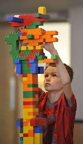
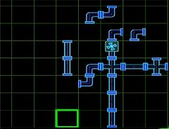

Code Size
=========

* [Outline](outline)
* [What is size?](#what_is_size)
* [The basic structure of code](#struct_of_code)
* [Sizing up Hello World](#sizing_up_hw)
* [Down to the basics - SSI](#ssi)
* [Turtles all the way](#turtles)
* [Back up to SSI/Java](#backup)
* [Sizing up the data](#sizing_data)
* [A new measure of code size](#turing_unit)
* [Static vs Dynamic size](#static_v_dynamic)
* [Engineer's Corner: Implementing Turing sizes](#engg_corner)

Outline
-------

why count size, compare with sloc and other current ways of counting size, basic structure of code: language, program, operation, sizing up Hello World as an example, therefore compound operations and containers, **still not found size of operations**, therefore SSI, add viz as lego blocks, size of sequence, size of if, add viz as pipes, size of loop, add viz of marble run, **add viz about graphs**, **still not found size of operations other than if and loop**, therefore go down one level, then infinite levels, **therefore resolve that at asymptote of the turing machine all sizes are 1, therefore define that all we need is a relative "base", then introduce the "turing" as the size unit relative to any base, then answer questions about sizing 2 langs relative to a base, then talk about platform affordances, then back up to hello world picking the java language as the base and count size that way, then present comparison with sloc again, then talk about sizing up static data, then talk about static vs dynamic data, then move to engineering and the simple and exact ways of counting size**.

What is size?
-------------

The common sense description of size is: 

		Size: How big something is. 

Length, area and volume are typical ways of quantifying how big something is. When applied to code, this essentially means how much code there is; specifically excluding ideas like how complex it is, how fit it is for its intended purpose and so forth.

Why do we need such a measure? The most common real-world use is estimation: when building new software or changing existing ones we like to estimate the effort involved. Is there a larger purpose, however - one that serves the practitioner and not just the manager?  I posit that size is one of those basic properties of code that aids in _understanding_ and _knowing_ code as well. We talk routinely of small, well designed codebases that can be understood and used easily; and also of large, unwieldy codebases that are difficult to understand. Wouldn't it be nice to quantify those subjective statements? A case might therefore be made that size is one of the "thing"s that we *should* understand about code. Also, note that the "small" and "large" parts mentioned above point to the size of the code and  the "easy" and "difficult" parts point to its complexity; and certainly the two are related. So quantifying size might lead to understanding other "thing"s about code.

### Current notions of code size

Let's first look at how size is measured currently. In my cursory review of the current state of affairs, there are two broad approaches to measuring size:

1. **Emperical**: The aim here is to have numbers that represent size so that decisions and actions can be taken based on them. [Source Lines of Code][sloc], [Function Points][fp], [COCOMO][cocomo], [Structure 101's fatness metric][s101] and [Halstead metrics][hals] seem to fit into this catergory.
2. **Descriptive**: These measures of size do use numbers that are easily derived from the source code, but they are used primarily to visualize it so that humans can grok it and take appropriately intelligent action. Code visualization tools such as [Code city][ccity], [Software cartography][scg] and Alan Kay's [Empire state building made of A4 sheets of code][akay1] are some examples of this type of measure.

[sloc]: http://tbd/
[fp]: http://tbd/
[cocomo]: http://tbd/
[s101]: http://tbd/
[hals]: http://tbd/
[ccity]: http://tbd/
[scg]: http://tbd/
[akay1]: http://tbd/

Here is a comparison of the pros and cons of these two approaches:

<table>
	<thead>
		<tr><th>Approach</th><th>Pros</th><th>Cons</th></tr>
	</thead>
	<tbody>
		<tr>
			<td>Emperical</td>
			<td>
				<ul>
					<li> Actually measurable (with some error, but still) </li>
					<li> Language agnostic</li>
					<li> Useful as gross comparison tools.</li>
					<li> Relatively easy to apply to small programs manually; and gracefully upgradable to bigger codebases with automation.</li>
				</ul>
			</td>
			<td>
				<ul>
					<li>Not "smart" units of measure in that they dont consider the structure of code *AS CODE*. With the possible exception of the Halstead metrics, the other approaches treat code as either text or conceptual "functions".</li>
					<li>Not accurate measures of size per se; just convenient ones.</li>
					<li>Not easily extended to other properties of code; the relations are forced and the equations (if any) have emperical constants and pre-conditions attached.</li>
				</ul>
			</td>
		</tr>
			<td>Descriptive</td>
			<td>
				<ul>
					<li> Easy for humans to understand a lot of information in one go. </li>
					<li> Able to transcend the implementation language depending on the abstraction chosen.</li>
				</ul>
			</td>
			<td>
				<ul>
					<li>Dont give direct feedback as to what's wrong; a practised user has to interpret the results.</li>
					<li>Do not actually measure anything at all; merely provide a visualization.</li>
				</ul>
			</td>
		</tr>
	</tbody>
</table>

Obviously, neither approach seems comprehensive nor feels right. Wouldn't it be nice to have a measure of code size that:

* Used the structure of the code **AS CODE**,
* Was language agnostic,
* Was indeed measurable,
* Was extensible to define other properties of code with,
* And yet was easy for humans to understand and use to understand a lot of information in one go?

That's what I'd call a natural measure of software size. The rest of this chapter is an attempt to build one. My approach is part engineering, part science: I'd like to develop a theory that is general enough, but with sufficient focus on how to apply it to real world software.

The basic structure of code
---------------------------

Programs, in general, can be described as a set of instructions or operations to do a certain task. The set of instructions or operations that make up a particular program is a subset of the available instructions or operations, and this superset is usually called a language. I'll repeat these concepts as definitions so that they can be referred to later:

		Language: A finite set of instructions or operations that can be used to write code.
	              All code is written in languages.
		Operation: The smallest unit of independent code execution in a language.
	           It is the basis of size measurement because of its atomicity.
	                                                                                     --(1)

Or in BNF-ish syntax:
		
		language  :=  operation+
		program   :=  operation+
		operation :=  ....smallest unit of code exec....
	                                                                                     --(2)

... which only highlights the fact that while we have a definition for Operation, we're not really close to using it to actually measure things. However, __if__ we knew how to size operations, this characterization seems to say intuitive that the size of a program is a summation of the size of the operations contained in it. In handwavy formulas, this can be expressed as:

		size(program)      = sum(size(operation)) for all operations in the code
		assuming
		size(operation)    = a known value                                               --(3)

This would be a nice result, but it still remains to be determined if size can indeed be characterized this way. This chapter will attempt to do just that.

Sizing up Hello World
---------------------

Let's start by trying to size up the most common program of all - the Hello World program - and use that to refine our intuitive expectation of summing up sizes. For specificity, I'll use Java, but I'm using Java as an example of programming languages in general, not as _the_ defining language for this theory. Here's Hello World in Java:

		// program 1
		public class HelloWorld{
			public static void main(String[] args){
				System.out.println("Hello World");	//line 1
			}
		}
		// SLOC: 5, Size: ?

So this is a program that weighs in at 5 SLOCs; but if we were to consider it as code instead of lines of text, what would its size be? 

Now, if you're not a Java person, you're likely to complain that I chose a bad language to to start with; and I'd almost agree. There's actually only one line of code in there - the one that prints the message; everything else is ceremonial structure. However, it does help expose the fact that code written in any language eventually has some superstructure; and in that sense Java's requirement to expose such structure is more useful for our size-measuring purposes than other languages' "hiding" of such structure "under the carpet", so to speak.

So, warts notwithstanding, let's see if we can use this example to examine the idea of code size. From line 1 alone, quite a few questions arise:

1. Line 1 actually has 1 package access, 1 object access and a function call - not very atomic.Is it a single Operation, really?  
2. What about the function call itself? `println()` is its not an actual language feature; its a method in a library. Should we actually count its call as an Operation?
3. ... And while we're counting, should we count the size of the method itself when all we're doing is calling it?

If we factor in the rest of the program, more questions arise:

4. Is the class definition an Operation? Similarly, what about `main()`'s definition?
5. SLOC is a clearly understandable number. How do we put numbers against this size concept?

Let's try to answer each question and form some opinions along the way.

### Question 1: Is System.out.println(...) one Operation?

Let's contrast Program 1 with some similar code that might flesh Qn #1 out better:
Here's one contrasting program:

		// program 2
		import java.io.PrintStream;
		public class HelloWorld{
			public static void main(String[] args){
				PrintStream outPS = System.out;    // line 1.1
				outPS.println("Hello World");      // line 1.2
			}
		}
		// SLOC: 7, Size > Size(Program 1)?

> Aside: Note that Program 2's SLOC went up because `PrintStream` had to be imported in, while Program 1 doesnt need that line because of "platform" affordances. More on such platform implications later.
	
Now, program 2 is admittedly contrived, but it's reflective of similar contrasts in real code where the latter representation would be useful \[[1](#ftnote1)\]. It splits out the original line 1 into two, separating the individual steps involved and it does increase the size of the program even if with an "unnecessary" addition of a local variable; but it highlights the fact that `System.out.println(...)` is something more than atomic - its a __Compound Operation__, if you will.

In fact, we could take it a step further and do this:

		// snippet 2.1
		PrintStream outPS;                 // line 1.1.1
		outPS = System.out;                // line 1.1.2
		outPS.println("Hello World");      // line 1.2
		// SLOC : 3, Size : ?

*Now* it cannot be broken down anymore and therefore matches our definition of a __Operation__ from above. So if we took the definition to heart and broke line 1 down this way, 3 "smallest possible" Java statements are required to make it. This means we have to recognize that some operations can be aggregates and add that as a definition:

		Compound Operation: An operation that can be broken down into smaller operations within the Language's set of operations.
		                                                                                 --(4)

... and update the BNF-ish version (2) to include this fact:

		language  :=  operation+
		program   :=  operation+
		operation := compound_op | simple_op
		simple_op :=  ....smallest unit of code exec....                                 --(5)

...and update formulas (3) to reflect this:

		size(program)            = sum(size(compound_op |simple_op)) for all operations in the code
		size(compound_op)        = sum(size(simple_op)) for all simple_ops that can replace the compound op.
		assuming
		size(simple_op)          = a known value                                         --(6)

### One more variation of Program 1

Are we done with Qn #1? Not quite; here's another version of the same program:

		// program 3
		public class HelloWorld{
			public static void main(String[] args){
				System.out.print("Hello ");
				System.out.println("World");
			}
		}
		// SLOC: 6, Size = Size(Program 2)?
		
This Program splits the final function call itself into two while still achieving the same end result. Clearly a statement can not only be broken into smaller bits, but what it *does* can also be broken into smaller bits. This hints at a couple of things:

* That a given problem can be solved by multiple programs. It seems intuitive that there's at least one program that solves it with the least size and that there are potentially more than one programs that solves it with more.
* What a program IS (structure and its size) does not predict what the program DOES (its meaning). We will have to look elsewhere for meaning - either downwards to the platform that it is based on or upwards to the human (or proxy human ie, code generator) that creates it. 

Onto Questions #2.

### Question 2: Is calling a library function an Operation?

While a library function itself is not a language feature, the ability to make a function call certainly is. A function call is essentially a shortcut to invoke a bunch of statements defined elsewhere; and supporting such a feature does require some effort on the language runtime's part. So Operation it is. In definition form again:

	Defining and calling functions are Operations if the language supports it            --(7)

### Question 3: Should we count the size of the function if all we're doing is calling it?

The size of the function itself (ie, that of its body) should be different from that of a call to the function, surely. This question and its answer does highlight that these two constructs - the definition and the call to it - are two separate operations that a language supports. The definition is clearly a compound operation, but what about the call? If the language supports the concept of functions and calling them, the operation of calling a function has to be atomic, by definition. Updating the BNF-ish definitions, therefore:

		operation   := compound_op | simple_op
		compound_op := function_def | ...other compound ops...
		simple_op   := function_call | ....other smallest units of code exec....         --(8)

Onto Question #4.

### Question 4: Is a class an Operation? What about functions?

At first sight, this question seems trivially answerable: line 1 in Program 1 is the only "working" Operation, so the others should'nt have much importance. However, it becomes interesting when contrasted with other languages that do not necessarily need containers such as classes nor a predetermined function like `main`. The same hello world in ruby (or Python), for example, would be:

		# program 4
		print "Hello World", "\n"	#SLOC:1, Size: ?

> Note: Yes, I know that this is possible because of "Platform affordances" and that behind the scenes are some intelligent defaults. I also realize that this is not the same as Java's `System.out`. As mentioned before, we'll deal with this "tip of the iceberg"-ness later.
	
Now it seems intuitive that the first program is "larger" than the second one, doesnt it? Or, to contrast in the other direction, what if we wrote our HelloWorld.java like so?

		// program 5
		public class HelloWorld{
			public static void main(String[] args){
				greet();				//line 1
			}
			public static void greet(){
				System.out.println("Hello World");	//line 2
			}
		}
		// SLOC: 8, Size: ?

This (contrived) version of the code is obviously bigger than the previous - while doing the same thing as before.

So Q#4 really is: Does a language's container structures contribute to its size? Going by the examples above where they "add to the structure", I would argue that they do; and thefore should be considered "compound" __Operations__ s with some non-zero size of their own. This also answers the question about `main()`' - and by extension - all functions: functions are containers and therefore have a non-zero size of their own in addition to contributing whatever size their contents have to the total size.

Updating  definitions from (7) and (8) above to include these facts, therefore:

		compound_op       := class_def | function_def | ...other compound ops...
		class_def         := class_construct + class_contents
		class_contents    := method_def*, field*
		method_def        := function_def
		field             := operation
		function_def      := function_construct + function_contents
		function_contents := operation+                                                  --(9)

and

		size(compound_op)        = size(function_def) | sum(size(simple_op)) for other compound ops.
		size(class_def)          = size(class_construct) + size(class_contents)
		size(class_contents)     = size(method) + size(field) for all methods and fields in the class
		size(method)             = size(function_def)
		size(field)              = size(operation)
		size(function_def)       = size(function_construct) + size(function_contents)
		size(function_contents)  = sum(size(operation)) for all operations in the function
		                                                                                 --(10)
Or more generally,

		size(container)         = size(container_construct) + size(contents)
		size(contents)          = sum(size(operation)) for all operations in container
		                                                                                 --(11)
Using (11) we can easily extrapolate to larger structures:

		size(app)             = size(app_construct)             + sum(size(programs in app))
		size(program)         = size(program_construct)         + sum(size(package|modules|classes|functions in program))
		size(package|module)  = size(package|module construct)  + sum(size(classes|functions in module|package))
		                                                                                 --(12)

Looking at (11) above, however, how different is a container from another Atomic Operation in terms of contribution to size? Its presence adds to the total size just as another atomic operation and the formula above ensures that its contents' size is accounted for. As long as we retain the `+ sum(size(contents))` part, we could treat containers as some more atomic operations during analysis.

### Question #5: So how to numerically calculate size?

So how do we put some numbers against these ideas? We're essentially at an impasse: We dont yet know how to size the atomic statements, nor do we know the size of the the containers themselves. All we have determined so far is: *If* we know the sizes of the statements and their containers, the overall size is an accumulation of individual sizes.

`Hello World` is as basic as programs get, but its still proven to be complex and high level enough to prevent us from being able say anything definitive about Operations and their sizes. Maybe we need to look at a simpler model of programming?

Down to the basics - SSI
------------------------

Let's try the simplest notion of code. All of programming has [famously][ssi] [been][spt] [depicted][vNMArch] as being made of 3 basic operations:

* Sequence, ie steps done in sequence
* Selection, ie the choice of one step vs the other, aka the `IF`
* Iteration, ie the ability to repeat steps that have been already been executed, aka the `LOOP`

[ssi]: http://en.wikipedia.org/wiki/Structured_programming#Low-level_structure_programming
[spt]: http://en.wikipedia.org/wiki/Structured_program_theorem
[vNMArch]: http://en.wikipedia.org/wiki/Von_Neumann_architecture

What can we say about a program that has some collection of these 3 operations? Well, assuming we know the "size" of each such operation, the size of the program(s) that contain these operations can be computed as an accumulation of their individual sizes, same as (3) above.
		
Let's try this out on each of the 3 operations, starting with...

### Sequence

Formula (3) certainly seems appropriate for simple _Sequential_ programs like "Print 5 superhero names", depicted here in pseudo-code:

		// program 6
		print "Superman"
		print "Batman"
		print "Green Lantern"
		print "Green Arrow"
		print "Aquaman"
		stop
		// SLOC: 6, Size: 6* units

Assuming the size of the `print` and `stop` operations were 1 unit, and using (3):
	
		size(program6) = sum(size(5 print operations & 1 stop operation))
		               = 1* + 1* + 1* + 1* + 1* + 1*
		               = 6* units
		(the * is to remind us that sizes being 1 is an assumption)                      --(13)
		               
... is 6* units. This is sort of similar to counting lines of code and fits our common sense notion that the code is "6 units long" or "6 units tall".

Would that be long or tall? Here's where a little physical analogy might help. 

We talk all the time about "building" software and code building has long been equated to piling Lego blocks on top of each other. And when heavy code breaks it crashes very similarly to how a heavy lego structure does. So let's equate size to height. 

One break from the normal way of using Legos, though: code legos are indeed stacked one block at a time, but by sticking each block __under__ the one that's already in place, not on top. That way, program 6 gets built in the order we read it, not from the last statement upwards.

But that was just a _Sequence_. Let's try adding in some ...

### Selection

... by writing a simple program to check if 5 is odd or even. Again, in pseudo code:

		// program 7
		rem = 5 % 2
		if rem == 1 then
			print "5 is odd"
		else
			print "5 is even"
		endif
		stop
		// SLOC: 7, Size: 5* sq units

This program is not just tall, it is wide too. Until the `if` is encountered, things are linear, but at that point we could go one of two ways. This can be visualized as as a "left+right" pair or a "down+side" pair, something like so:

		// program 7 (alt view)
		+----------------+
		|rem = 5 % 2     |
		+----------------+-------------------+
		|rem == 1 ?      |                   |
		|    true        |    false          |
		+----------------+-------------------+
		|print "5 is odd"| print "5 is even" |
		+----------------+-------------------+
		|stop            |
		+----------------+

So, what then, is the size of an `if`? The size of the main branch contributes to the length of the program it's in, while the size of the alternate branch adds to the width of the program. It seems safe to say, therefore, that:

		size(if)      = size(condition check) + sum(size of individual branches)
					  =  c + sum(b) 
		where
		            c = a non-zero size of the condition check
		            b = size(branch)  
		              = 1 (width) x h (height of branch)                                 --(14)

Applying this to the `if` in program 7 and assuming the condition check is a size 1 (because there's only one comparison being done), we get:

		size(program7's if) = size(condition check) + size(if branch) + size(else branch)
		                    = 1* + 1 x 1* + 1 x 1*
		                    = 3* sq units                                                --(15)

To use this result in calculating Program 7's size, we've to represent all sizes as "areas" first. Assuming again that the `print` operation was 1 unit tall, we should add that it is 1 unit wide. Program 7's size(area) therefore becomes:

		size(program 7) = sum(size(operations))
		                = size(assignment operation) + size(if) + size(stop)
		                - size(modulus op + assignment) + size(if) + size(stop)
		Now assuming size(modulus op) = 1, we get
		                = 2* + 3* + 1*   assuming the assignment operation is also of size 1.
		                = 6* sq units, compared to a SLOC of 7.                          --(16)

For completeness, lets convert Program 1's size to "area" units as well:

		size(program 6) = 6* sq units                                                    --(17)

Note that program 7 has a SLOC of 7, but a size of 6* sq units. Smaller numerically, but larger by size and semantics.

Does our lego block analogy still hold up, though? The `if` requires data to be used, a decision to be made and one of (potentially many) alternate routes to be taken. This is probably best visualized as something "flowing" from one statement (ie block) to another, with control points to direct flow. Maybe pipes are a better analogy therefore?

Sorry I couldnt find better pictures, but hope these convey some part of the idea. Every time you see a T-junction or a Cross, think `if` operation; otherwise the flow of liquid represents the Sequence.

Unsatisfying as the pictures are, more so is the analogy. While data does flow from one operation to another, it doesnt flow like a liquid does. Data in a digital computer is discrete and better described as chunked than fluid. Is there a better physical analog? What we need is something that is built using standard parts (like legos) and allows things to flow through them (like pipes) but only allows solid things. 

Without further ado, I present:

... the marble run! It does everything we would like our physical analog of code to do and then some. It has the standard blocks that link together obviously (which is a slight difference - that the connectors are fixed to the blocks); but it also has "source" and "sink" pieces, pieces that change direction (not all of which are logically important) and even pieces that have some built-in logic. If you look closely you'll find that one of the purple pieces is a simple flip-flop (aka `IF`)- it sends successive marbles down alternate paths.

So its seems that the marble run is indeed a good choice as our physical analog for code. We will use it only as a mental model in our theory forming activity, but there __are__ [real world marble runs that have been created to do actual computations](http://www.hackerspace.lu/2012/01/21/marble-adder/); so its certainly an apt choice.

Ok, enough fun.Let's try the final operation ...

### Iteration

... by writing a simple loop to print 1 to 5. Again in pseudo code:

		// program 8
		loop i = 1 to 5
		  print i
		end loop
		stop
		// SLOC : 4, Size: ?

Written in this form, it seems like the `for` is a short cut to write out a long sequence of operations. Indeed, program 8 can be rewritten as:

		// program 8A
		print 1
		print 2
		print 3
		print 4
		print 5
		stop
		// SLOC : 6, Size: 6* sq units
		
Such "unfolding" of loops is not uncommon; and viewed this way we could conclude that a loop's primary size is its height, which is equal to the number of operations within the loop times the number of times those operations are looped around. Not all loops can be unfolded thus, however, as a simple example that uses a `do-while` loop or an infinite loop will attest. However, there's an alternate way to express a loop, presented below. This will work for any kind of loop including ones whose number of iterations cannot be determined up-front. 

		// program 8B
		      i=1
		 top: if not(i <= 5)      // line 1
		 		  goto end 
		      else
		          print i
		          i = i + 1
		          goto top        // line 2
		      end if
		end: stop
		// SLOC : 9, Size : 7* sq units

Now the true nature of _Iteration_ becomes obvious: `Iteration = if + goto`. The `if` sets up the conditions for iteration and the `goto` executes it. The `goto` is therefore the key ingredient in getting iteration to work, so let's try to understanding it a little better.

A goto is a route from one "block" to another, a connector. Program 8B has 2 obvious kinds of gotos and one that's not that obvious:

1. The conditional goto that is guarded by a comparison (line 1);
2. The unconditional goto that just jumps to another location (line 2); and
3. The implicit goto between operations.

The _Unconditional `goto`_ alters the flow of execution and skips ahead to another location, adding the "width" (or more generally, another dimension) to the program. If the destination of the `goto` is not local to the point of branch off, the impact on size is somewhat difficult to determine.

_Conditional `goto`s_ remove some of that uncertainty by checking a condition before branching. Adding the check reduces the chance of an invalid target or that of "spaghetti code" - an unholy tangle of wild gotos that only makes sense when you write it. 

However, conditional gotos only reduce the chance of indeterminate size, they do not eliminate it. For eg, the `goto end` line in program 8B could lead to some location that is far away from the rest of the code. So the deciding factor for size of a goto is whether or not its destination is known. Let's call the ones with known, defined destinations like 'top of the loop' as _Bound Goto_s and the ones that are not such as _Unbound Goto_s. Their sizes, therefore, are:

		size(bound goto)  = 1* width x N height already counted elsewhere
		                  = 1* width x 1* height
		                  = 1* sq units                                                  --(18)

That is, the height of a bound goto exists, but it has typically been already considered as part a "larger structure", so only the contribution of the single goto "block" need be considered.

		size(unbound goto) = G
		where            G = 1 unit height x G1 width  or
		                   = 1 unit width x G2 height                                    --(19)

That is, while we could measure one or more "dimensions" of the unconditional goto, there will always be one dimension that we cannot quantify and therefore its overall size remains an unknown quantity.

Finally, _Implicit `goto`s_: On the "main line" of code, implicit gotos guide the execution of code by stringing successive operations together. In fact the machine executing these programs (or any general computer, for that matter)  can be thought of executing this meta-program:

		// meta program 1
		1: read a specific location for the address of the next instruction to execute
		2: execute it
		3: if step 2 didnt set the next instruction to execute, autoincrement to next address in the same location
		4: goto 1
 
So the gotos exist, even if we do not depict them in code at the level of normal discourse. The difference between these gotos and the others is that they connect one operation to another "by default" i.e, in the most obvious way that they are supposed to be connected. As such, its safe to posit that they do not contribute to the size. That is,

		size(implicit goto) = 0                                                          --(20)

In program 8B, both the `goto`s are well-behaved. They dont fly off to kingdoms unknown: they go to the top of the loop or exit it - two very well known spots. So they are clearly bound gotos. So the size of program 3B would be:

		size(program 8B) 	= sum(size(operations))
							= size(assignment) + size(if) + size(stop)
							= 1* + size(condition) + size(branches) + 1*
							= 1* + 1* + (1 x 1* + 3 x 1*) + 1*
							= 2* + 4* + 1*
							= 7* sq units                                                   

More generallly, the loop in program 8B could be written in template form as:

		// program 8B-templatized
			  <<.. steps before loop..>>
		      <<initialize loop>>
		 top: if not <<loop condition>>
		 	  then
		 	  	goto end
		 	  else
	            <<loop body>>
	            <<increment loop>>
	            goto top
	          end if
		end:  <<.. steps after loop..>>

Thus,

		size(program 8b loop)     = size(init loop) + size(if)
		Now, let  size(init loop) = i, some nonzero size depending on the type and number of operations

			      size(if)        = size(condition) + size(if branch) + size(else branch)
			                      = size(condition) + size(goto end) + [size(loop body) + size(increment loop) + size(goto top)]
			                      = c + 1* + [ b  + p + 1* ]
		                 
		                 where  c = a nonzero size for the condition check
		                        b = a variable loop body size
		                        p is some variable nonzero size for the increment step

			                      = c + b + p + 2*
			                      = c + b + p + 2*
		Thus,
		          size(loop)      = i + c + b + p + 2*                                   --(21)

... which still comes out to a clean enough "sum of parts" type of equation. 

Back to program 8, however; for we were trying to determine the size of _that_ loop. Here's its template form:

		// program 8-templatized
		loop <<loop init>> to <<loop condition>> <<implicit loop increment>>
		  <<loop body>>
		end loop

At this level of abstraction, all the other elements of the loop are present, but there are no gotos. The gotos are somehow "subsumed" in the mechanism of the loop such that the user of the loop doesnt have to know about it. So at this level, the size of a loop would be:

		size(program 3 loop)   = i + c + b + p                                           --(22)

What about the other forms of loops that we alluded to earlier? Here's the template form of the other typical versions of the loop: the `while` and the `do-while`:

		// while-template                        // do-while-template
		<<loop init>>                            <<loop init>>
		while <<loop condition>>                 do
			<<loop body>>                           <<loop body>>
			<<loop increment>>                      <<loop increment>>
		end while                                while <<loop condition>>
		
All are functionally equivalent and from inspection its obvious that they have the same size (even if we count the `c` piece in different order). They are structurally different, but that's not germane to their size. 

So to summarize the discourse on loops:

		size(loops with goto) = i + c + b + p + 2*
		size(for loop)        = i + c + b + p
		size(while loop)      = i + c + b + p
		size(do while loop)   = i + c + b + p                                            --(23)

Or more generally,

		size(loop)            = i + c + b + p + o
		              where o = overhead at level of abstraction
		                          = 0 at SSI level
		                          = 2* if gotos are explicitly used                      --(24)

To answer the specific question of Program 8's size, however, we'll have to apply (24) and make some assumptions on the sizes again. Since both the initialization and increment steps in this case are single operations, we'll assume they're also of size 1 sq unit. The loop body consisting of the single print operation has long been deemed of size 1 sq unit; and the condition is simple enough so we'll take that too to be a size 1. Now applying these values we get:

		size(program 8)  = size(loop) + size(stop)
						 = i  + c  + b  + p  + o + 1*
						 = 1* + 1* + 1* + 1* + 0 + 1*
		                 = 5* sq units vs SLOC: 3

### Summary

Let's review: we started off by using the simple SSI model because it was simple and could easily be related to most basic operations. We focused on sizing programs, wrote 3 programs in pseudo-code and came up with formulas for the 3 operations in the model using a (yet unnamed) new measure of size for them. Here're the sizes that we arrived at using the new formulas and measure:

		size(program 6) = 6* sq units vs SLOC of 6
		size(program 7) = 6* sq units vs SLOC of 7
		size(program 8) = 5* sq units vs SLOC of 3                                       --(25)

#### Comparison to SLOC

Admittedly, there's a lot of hand-waving going on here; but the contrast with SLOC is interesting. The 2D-ness of our size unit seems to hint at the structure that goes into loops and conditionals better than the "flat" count of lines. Program 7's size is smaller compared to its SLOC because the textual "overhead" of denoting loop structure is removed from the equation, while Program 8's textual brevity in having all structural elements of the
loop contained in the same line is called out, increasing its size when compared to its SLOC.

#### Combining Sequence, Selection and Iteration

SSI essentially talks about programs as being *combinations* of sequence, selection and iteration; while we've been doing all our analysis in isolation. Let's fix that. Our formulas for sizes of these individual operations are:

		size(sequence) = sum(size(operation)) for all operations in sequence       --(2') program replaced with sequence
		size(if)       =  c + sum(b)                                               --(14) 
		size(loop)     = i + c + b + p + o                                         --(24)

Since all these formulas are additions, we *could* treat the `if`s and `loop`s as "compound" operations that contribute a known size to a larger sequence that is the program; and at this larger level, there is only the sequence. This means that (2') above can be restored back to its original form:

		size(program) = sum(size(operation)) for all operations in program

		Using (26),
		              = sum(size(ifs)) + sum(size(loops)) + sum(size(other operations))     --(27)

_Now_ we're getting somewhere. We started off with the expectation that the size of the whole would be the sum of the size of the parts; and we've reached that result for the three primordial operations. If we are able to shore up those pesky asterisks we've had to put on the "other" operations also as sums of sizes, we'd be golden.

Also note that as long as all we're doing is measuring size, the order of operations dont seem to matter - only that they are counted. To use the marble run analogy, the size or color of the blocks dont matter - only their number. Obviously, this will not apply for other measures of code such as complexity: we build code in a particular order explicity so as to effect certain results; but for size this is a Good Thing(TM).

#### Levels of Abstraction

The discussion above kept moving between alternate ways of representing things: Program 7 was represented as programs 7A and Program 8 as 8B to depict the same program with different constructs. These 2 ways can be thought of - especially within the Structured Programming context - as two different languages: the former being a pure structured program with no gotos and the latter as a "lower level", unstructured language that DOES have gotos. This hints at two things that we'll explore soon:

* The size of a construct could differ by level of abstraction even if the two representations are the same in terms of function and semantics.
* Constructs that are considered "atomic" at one level could be "compound" at another.

#### Moving beyond SSI

 The SSI model has been a good deep dive into simple operations, but at the level of abstraction that SSI is described, the `if` and the `loop` are the only concepts required to express general computing, so "what each step in a sequence does" is glossed over. To size an actual codebase, however, we do need to consider each such operation and size them. Up until now we've been making assumptions on their size using those pesky asterisks, but they _do_ need to go.

Turtles all the way
-------------------

Ok, so its finally time to address the size of operations. To recap: We've decided that there are simple and compound operations and have defined the former as operations that cannot be reduced further within a language's structure. The size of compound operations we declared was the sum of the sizes of the simple operations that made it up, but we were'nt sure how to determine the size of each such simple operation itself. So for example, a snippet like 2.1 (repeated below) has...

		// snippet 2.1
		PrintStream outPS;                 // line 1.1.1
		outPS = System.out;                // line 1.1.2
		outPS.println("Hello World");      // line 1.2
		// SLOC : 3, Size : ?

... a variable declaration (1.1.1), an assignment(1.1.2) and a member access combined with a function call (1.2). Each of these operations dont _feel_ the same size simply because I immediately begin to imagine their implementation and know that they must be inherently different in implementation and therefore of different sizes.

These questions are still within the same language. With real-world code we will have further issues:

1. When we start comparing one language with another we will have to answer questions like "How does a Hello World in Java compare to one in Ruby?", which will quickly devolve into "How many Java print statements equals one Ruby print" and such like.
2. When we consider applications written using multiple languages (as most applications are today) we might want a universal size metric that applies across all statements in all languages to measure size uniformly. More importantly, it will come handy when measuring two solutions to the same problem using different technology stacks.

Notice, however, that we've again started talking about the base platforms upon which the languages are written and not the languages themselves? What if the implementation is not accessible to us? Or if it is actually hardware and therefore not interpreted or sized the same way?

### Down One level

For argument's sake, let's say we do have access to the platform and can measure the sizes in that language. Would we be able to say anything more about the size of the program under consideration? Let's work it out:

For any language L with n unique Simple operations (including containers) S1, S2, ... Sn (hereafter abbreviated to <L,S,n>), the size of any program P in L is:

		size(P) = K1.size(S1) + K2.size(S2) + ... + Kn.size(Sn)    
			= sum(Ki.size(Si)) for i: 1 to n                                             --(28)

since any or all of the unique simple operations (and/or containers) will have to be used in `Ki` quantities to make the program.

If a language <L,S,n> is implemented in terms of another language <L',s,m>, each of its unique simple operations S1...Sn can be themselves expressed as programs in L'. Since the simple operations in L' are s1,s2,....sm, we get:

		    size(S1) = sum(Kj.size(sj)) for j: 1 to m
	|||ly,  size(S2) = sum(Kj.size(sj)) for j: 1 to m                                    --(29)

... and so forth. 

But L' *itself* is most probably implemented in terms of another language, say L''. So even if we were able to say anything definitive about the sizes of S1 and S2, it would be in terms of L'' sizes. L'' could very well be built using L'''. Where will this end?

### Down Infinite Levels and back

To illustrate the true nature of this rabbit hole, I present an excerpt from the [Grand Unified Theory of Software Engineering, page TBD][GUTSE]:

[GUTSE]: http://tbd/

> ... Equally frustrating, also these executors of specifications are intangible. To start with, a software process, such as a Java Virtual Machine, is not only a consumer of Java Bytecode specifications, it is also itself an executing program specification, e.g., the file with the name `jvm.exe`. But if we explain the software process in terms of a specification, then this explanation only brings us back to the intangibility of the specification, so we have gained nothing in concreteness. Perhaps, then, we can become concrete by considering the executor of the executor. Typically, a java Virtual Machine is executed by a hardware processor; surely this must be a firm base on which we can base our discipline. Unfortunately, the relief of finding something tangible is short-lived. Because just like an electic capacitor is constructed as a model of the ideal capacitor, a processor is a (physical) model of an ideal processor. It is not important that the processor in a typical computer is implemented in silicon, for it could have been implemented using vacuum tubes, a small and nimble-fingered preson, or yet another software program. So also the processor is in this sense independent of the medium in which it is constructed. In the words of Edsgar Dijkstra:
>> Originally I viewed it as the function of the abstract machine to privide a truthful picture of the physical reality. Later, however, I learned to consider the abstract machine as the "true" one, because that is the only one we can "think"; it is the physical machine's purpose to supply "a working model", a (hopefully) sufficiently accurate physical simulation of the true, abstract machine.

In other words, if we started this journey down the levels of implementation to try and understand the size of a Java function call, the next immediate step is the JVM source. From there we could proceed onto its Java or C source, the source of the C runtime, the source of the Assembly runtime that follows, onto the CPU, its microcodes and eventually onto the very NAND gates that make up the machine that runs the code. But even at this level, we'd be sizing up something that doesn't exist physically but is merely modeling (as closely as possible within the 0-5V range) a concept that exists in solely somebody's head. 

At this asymptote, size has no explicit meaning because all operations just happen and do not need to be broken down further. They do what they do without resorting to further delegation. As such, the MUST all be of the same size. At any level above it, there is merely the combinations of these operations in particular orders to achieve particular effects. Size has the meaning that it is the count of the primordial operations. And thus we could climb back up through the levels culiminating in a Java print function call. 

In the formulas we've been writing till now, this would be:

		If <L1,S1,n1>, <L2,S2,n2>, <L3,S,n3>, ... <L*,S*,N*> are a set of languages such that 
		L1  is implemented in L2
		L2 is implemented in L3, and so forth till
		L* is a final, asymptotic language
		
		if s is a statement in S1,
		size(s) = sum(Ki.size(S2i)) for i: 1 to m
		        = K1.size(s1) + K2.size(s2) + ... + Km.size(sm)
		Now expressing each si in terms of L'',
		        = K1. sum( Lj.size(tj) for j: 1 to o ) +
		          K1. sum( Mj.size(tj) for j: 1 to o ) +
		          ... +
		          Km. sum( Nj.size(tj) for j: 1 to o )
		where Lj, Mj and Nj are sets of constants that stand for the count of tj statements used to make each of the si's.
		At the level L', there are m such constants
		At the level L'', there are o.m such constants
		At the level L*, there are 

Ks in terms of binomial selection of s's
Even if we reach that asymptocially primordial language, would we have said something about the size?
ie 

what would the size of statements in Linf be? Such an executor would "just do things" and therefore can be considered to have statements of unit size. Thus all "Javaness" or "Ruby ness is purely from the structure and not meaning?????

===============COPIED HW CONTENT HERE ===================
===============REWRITE LINE HERE ===================
A natural way of measuring code size
--------------------------------------

conceptual operations to compound statements to derivation of atomic statement

old text
=======

Like before, let's try things out and form opinions as we go. We have to come up with numbers for measuring the sizes of:

* The primordial `IF`s and `LOOP`s
* Statements in both Simple and Exact methods
* Containers

### First up: Size of the primoridial `IF` and `LOOP`s. 

Since our discussion about containers, these look suspiciously like containers, dont they? The `IF` doesnt do anything else other than directing traffic to one sequence of statements or the other, while the `LOOP` is merely re-running code based on a hidden `IF`. So we could just apply the rules for containers on them too, right?

Mostly. We'd be discounting unconditional jumps (such as `goto`s in in Java or C, or `JMP` in most assembly languages) and sphagetti code if we did so. It's entirely possible to model the primordial concepts as even more primordial `IF` and `JUMP` "opcodes" to count such code, but we'll apply the 80-20 here and focus on code that is structurally sound for the most part.

[TODO: Break primordial concepts into opcodes and allow counting of sphaghetti code.]

So, `IF` and `LOOP`s are containers. We'll defer their calculation to later when we deal with containers in general, therefore.

### Next: Size of Statements. 

We've to try counting in both the simple and exact way, so here goes.

**In the Simple way**, since one statement cannot be differentiated from another, the best we can do is to assume some standard size for all statements. The simplest standard size would be `1`, but if we emperically have (say, by comparison to exact measurements) an _average size_ that is known, that could be used too. Obviously, this would be a language or platform specific value. Anyway,

		simple_size_unit(statement)	= 1
		simple_size_avg(statement)	= Savg	(some emperical value)
		
**In the Exact way**, there are even more difficulties. We do have the ability of differentiating between different types of statements, but how do we ascribe a number to each type of statement? If we have access to the implementation of those statements ( eg, we have access to the source code of the Java compiler and runtime) we could measure the size of that code and apply the `size(container)` formula. But what if we didnt have access to the source, or dont want to go down that rabbit hole?

We will do exactly that later, but for now, let's see how far we can go without doing that. We have a couple of shortcuts:

* **Unit Size**: Like in the simple way, we could give the exact statements unit size. This is better than the simple way because all those compound statements have been broken down already and will thus have size > 1; but it doesnt count the *actual* size of the exact statements
* **Constant Size**: Like the second option in the simple way, we could give all statements a size greater than one. This would be useful to compare codebases written with multiple languages, for example.
* **Indexed or Relative Size**: Finally, we could make a half-hearted attempt at going down the rabbit hole. It works something like this: we pick one statement as the unit statement regardless of its actual size; and then index every other statements' size to the chosen one's, ie, divide their sizes by that of the unit statement. This way, we express size as a number relative to another size and can absolve ourselves from doing any actual measurement by picking a unit statement and guessing the sizes of other statements relative to it.  I call it indexed because all sizes are indexed to the unit statement's size.

In formula form that would be:

		exact_size_unit(statement) 		= 1
		exact_size_const(statement)		= Sconst	(some constant value)
		
		exact_size_ndx(unit_statement)		= 1
		exact_size_ndx(other_statement_1)	= n1		(some number)
		exact_size_ndx(other_statement_2)	= n2		(some other number)

We'll need some worked examples to grok this better; but let's put a hold on that till after we've defined...

### Size of Containers

As a refresher, the formula for contained code is `size(code) = size(container) + sum(size(contents))`. Let's apply this the primordials and containers of various kinds.

In coming up with numbers, however, the definition of the __Exact Statement__ above influences the thought process: can we calculate size of something by first assuming it doesnt exist and calculate the size of statement used to simulate its existence? For eg, can the size of a function container be determined by the number of __Statements__ it would take to mimic function calls without such a facility being available in the language? This thought underlies much of the exposition below.

**First:`IF`**:  Can `IF` be built from other statements? It doesnt seem like it; the ability to compare values and branch based on that comparison **NEEDS** to be part of the platform for it to work in a language. So `IF` is primordial; and applying the formula, we get:

		size(IF block) 	= size(IF) + sum(size(contents))

`IF` being a primordial, we can safely set `size(IF) = 1`. Its contents, however, are the multiple paths that can be taken depending on the condition being tested; and therefore can be of varying sizes. What then, is the size of the contents? Should we consider that some paths might never be executed? If we're measure size, I'd say NO. _Dead code still adds to the size of the code_. So,

		size(IF contents) = sum(size(each path))

**Next up: `LOOP`**. Again, it doesnt seem like something that can be replaced. Sure, you can unroll loops if you know the number of times you're looping, but in general you dont. So this seems like a safe bet as a primordial. Applying the forumula to the `LOOP` turns out to be most straight-forward of all the containers. Its intrinsic size is unit (because it is primordial) and the size of its contents are summed up. Or in formulas:

		size(LOOP) = 1
		size(LOOP contents) = sum(size(statements in LOOP))
		
**Next:Functions/Procs/Modules/Programs**: Containers exist for a number of reasons: to encapsulate logic, to provide namespaces, to denote process boundaries. Its very possible to visualize the mechanism that is required to keep up the facade of containment because there were machines in the not-too-distant past that didnt have such features. However, the exact way by which the simulation is achieved will certainlny differ from one language to another. Therefore, we're again f aced with choices: Do we simplify and treat all containers the same? Do we consider them different, but take a guess as to their sizes? Or is there a "one true" way of universally measuring size of a container?
If such a way exists, it certainly entails a journey down the aforementioned rabbit hole, so we will talk no more about it here. Instead, we will blindly march onwards with our shortcuts and see where they take us. Our options are:

* All containers are Unit sized
* All containers have non-trivial size, but that's about all we can say
* All containers have a constant size
* One container can be considered the unit container and all others sized in relation to it.

Or in forumulas:

		size_unit(any container) = 1
		size_nonzero(any container) = C //det by practicioners.
		

Before we try to answer those questions, let's consider if it makes sense to "go one level down" in the first place. Can we stop at just one level down? If not, what *is* the bottom? To illustrate the true nature of this rabbit hole, I present an excerpt from the [Grand Unified Theory of Software Engineering][GUTSE]:

[GUTSE]: http://tbd/

> ... Equally frustrating, also these executors of specifications are intangible. To start with, a software process, such as a Java Virtual Machine, is not only a consumer of Java Bytecode specifications, it is also itself an executing program specification, e.g., the file with the name `jvm.exe`. But if we explain the software process in terms of a specification, then this explanation only brings us back to the intangibility of the specification, so we have gained nothing in concreteness. Perhaps, then, we can become concrete by considering the executor of the executor. Typically, a java Virtual Machine is executed by a hardware processor; surely this must be a firm base on which we can base our discipline. Unfortunately, the relief of finding something tangible is short-lived. Because just like an electic capacitor is constructed as a model of the ideal capacitor, a processor is a (physical) model of an ideal processor. It is not important that the processor in a typical computer is implemented in silicon, for it could have been implemented using vacuum tubes, a small and nimble-fingered preson, or yet another software program. So also the processor is in this sense independent of the medium in which it is constructed. In the words of Edsgar Dijkstra:
>> Originally I viewed it as the function of the abstract machine to privide a truthful picture of the physical reality. Later, however, I learned to consider the abstract machine as the "true" one, because that is the only one we can "think"; it is the physical machine's purpose to supply "a working model", a (hopefully) sufficiently accurate physical simulation of the true, abstract machine.

Even if we reach that asymptocially primordial language, would we have said something about the size?
ie size(S in L) = size(impl of S in L0) = sum(size(s's in L-1)) ...... sum(size(sinf in Linf)

what would the size of statements in Linf be? Such an executor would "just do things" and therefore can be considered to have statements of unit size. Thus all "Javaness" or "Ruby ness is purely from the structure and not meaning?????

But then what is materially different between a routine and a base platform? Earlier, I defined `container` as 1routine | program | app | ...` which obviously increases in size, but what if we went further below the statement? This is exactly the question that we've to face in coming up with a convincing answer for size of atomic statements.

Even if we did have access to the platform and measured the sizes in that language, would we have said anything more about the size of the program under consideration? Let's work it out:

		Let L  = the language under consideration
		and L0 = its base language
		and n  = number of unique statement types in L0
		and s1,...sn = sizes of unique statement types in L0
		
		Further,
		Let S1 and S2 be statements in L that are made up by some combination of statements from L0.
		Then,
		size(S1|L0) = sum(size(statements from L0 that make up its implementation))
		            = c1.s1 + c2.s2 +....+ cn.sn
		where the notation "|L0" should be read as "in terms of L0",
		and   the c's are the # of times each s appears in the implementation of S.
		
		Similarly,
		size(S2|L0) = k1.s1 + k2.s2 +....+ kn.sn
		where the k's are another set of constants.
		
If we now compare S1 and S2, what can we say about their size? If `size(S1|L0)` is the same, bigger or smaller than `size(S2|L0)`, does it mean that `size(S1|L)` is the same, bigger or smaller than `size(S2|L)`? Maybe, maybe not. Depends on the meaning of S1 and S2 with respect to L. What we can say - at best - is that the sizes wrt the base language influence the language's statements; the nature of influence is not clear.

Maybe we could "abstract out" these the Java-ness (or whatever-language-ness) of a statement by ascribing a common size to the base platform itself? An analogy from physics might help: an object has _Mass_, which is an intrinsic constant property and _Weight_ which is dependent on the gravitational pull that another object exerts on it. So my mass remains the same regardless of the planet that I'm on, but my weight varies from one planet to another. If such a thing were possible, we could indeed say:

		size(Java Statement of type X) != size(Ruby statement of type X)
		because 
			size(Java Statement of type X) = Gjava . 1
			size(Ruby Statement of type X) = Gjava . 1

However,  

So as a pure "isolated black box" exercise, we could treat them as "blocks of the same size" and say that all atomic statements have unit size, ie 

		size(statement) = 1 for a given language L

TODO: WAS GOING TO MAKE THE JUMP INTO DEFINING WEIGHT VS MASS ETC AT THIS POINT IN CONTRAST WITH TEXT ABOVE AND BELOW.
Let's see if some analogy from the physical world helps. We call something big (or small) depending on how much area or volume it takes up. Two things could be of the same size, but one could be heavier than the other if its made of a denser material. The same thing could also be heavier or lighter depending on the planet it is on. In formulas

		Mass = interial momentum
		Size = Volume or area
		Density = Mass / Unit Size
		Weight = Mass x Gravitational Acceleration due to Planet P
		
	           

TODO: UNITS
TODO: CODE AS A STRUCTURE.

Engineer's Corner
-----------------

For a small program like the one above, this is fine, but for any non-trivial codebase we cannot expect to get a true count of atomic statements without some medium-to-high complexity parsing of the source - something that might not be acceptable in all cases. If we instead took the shortcut of just considering line 1 a single statement, its size is 1. So: we can take one of two stances to answer Question #1:

1. __The Simple Way__: A statement is whatever appears between two statement separators per the language's grammar.
2. __The Exact Way__: A statement is quite literally the simplest statement that could be written in the language; any time you can convert a statement in the language's grammer into a set of smaller statements within that same grammar that effectively does the same thing, it cannot be considered an atomic _Statement_. Its a Compound Statement; and the size of such a statement is the sum of the sizes of all the atomic statements that replace it.

The Simple way is good in that it is easily applicable - both manually and with tools; and bad in that expressive languages can "pack a lot of wallop" into a single complicated statement (I'm looking at you, APL) which will not be represented truthfully in the size of the program. But it can be considered the next incremental step to counting SLOC - with the statement separator replacing the newlines.

The Exact way is good in that it tends towards purity in measurement - code can be sized in terms of the atomic operations supported by the language itself and/or its runtime. It does, however, require non-trivial understanding/parsing of the source by human/tool to arrive at the exact size of code.

Should we pick one method over the other? The scientific mind suggests discarding the Simple for the Exact. The Simple approach, however, might be useful for "rough estimates". It could also be that the difference between sizes arrived at by the two methods are statistically close enough for a sufficiently large body of code that we might not want to go through the pain of calculating size exactly.

So let's keep both for now.

[snp fromtop]
To summarize so far:

1. __Statement__ is the unit of measure for software size.
2. __Statement__ can be defined in two ways:
	* Simple: A statement is whatever appears between two statement separators per the language's grammar.
	* Exact: A statement is the simplest statement that could be written in the language; a statement in the language's grammer that can be converted into a set of smaller statements within that same grammar is a __Compound Statement__ and should be converted to that set of smaller statements to calculate size. Its size is equal to the sum of the individual statement's sizes.
3. Code containers such as functions, procedures, modules, programs, etc have non-zero size of their own; in addition to the cumulative size of their contents. As such containers can be treated as atomic statements themselves for size calculations.
4. We have yet to figure out how to size the atomic Statements themselves.

[snp fromtop]

Well, maybe we dont have to. Instead of actually analyzing atomic statements, we could always fake it, err, make some educated guesstimations :)

For instance, what if we took the size of the atomic statements and all containers to be 1? What this means in principle is that we dont care what the actual sizes of atomic statements are since we're not bothered about what happens below the level of the language under consideration. As far as we know, things below that level "just are there" and therefore we will treat all atomic statements as "blocks of the same size". Similarly, we will treat all containers as being equivalent to single blocks.

Yes, this does mean that we're comparing apples to oranges; but let's see how far it takes us.

So, applying the formula

		size(code in container) = size(container) + sum(size(contents)) for all contents in the container

...to program 1, we get:

		size(program1) = size(program) + size(main)
		               =      1        + size(main)
		Now,
		 size(main)    =      1        + size(statements)
		 size(stmts)   =      1 if using simple approach
		               =      3 if using exact  approach
		Thus,
		size(program1) = 1 + 1 + 1 = 3 (simple)
		               = 1 + 1 + 3 = 5 (exact)

Doing the same exercise for all the programs we've written so far gives us:

Table 1
<table cellpadding="1" border="1">
<tr align="middle" valign="top">
	<th align="left"> Program </th>
	<th> SLOC </th>
	<th> Size(Simple) </th>
	<th> Size(Exact) </th>
	<th> Comments </th>
</tr>
<tr align="right" valign="top">
	<td align="left"> Program 1: HelloWorld.java </td>
	<td> 5 </td>
	<td> 3 </td>
	<td> 5 </td>
	<td align="left"></td>
</tr>
<tr align="right" valign="top">
	<td align="left"> Program 2: HW.java with SOP split </td>
	<td> 7 </td>
	<td> 5 </td>
	<td> 6 </td>
	<td align="left"> 
		size(import) = 1.  
		Exact size(line 1.1) = 2 because it's eventually equivalent to the first 2 lines in snippet 2.1 
	</td>
</tr>
<tr align="right" valign="top">
	<td align="left"> Program 3: HW.java with 2 SOP calls </td>
	<td> 6 </td>
	<td> 4 </td>
	<td> 8 or 6 ?   Ans: 8</td>
	<td align="left"> 
		Should the two System.outs be expanded with duplication or not?  
		If yes, each line has size 3; if duplicates are removed, the two lines have a combined size of 4 
		Ans: Yes, line has size 3. See below for discussion.
	</td>
</tr>
<tr align="right" valign="top">
	<td align="left"> Program 4: Hello World in Ruby </td>
	<td> 1 </td>
	<td> 1 </td>
	<td> 1 </td>
	<td align="left"> Is a Ruby/Python size 1 the same as a Java size 1? </td>
</tr>
<tr align="right" valign="top">
	<td align="left"> Program 5: HW.java with greet() </td>
	<td> 8 </td>
	<td> 5 </td>
	<td> 7 </td>
	<td align="left"> 
		size(greet)=1.  
		size(SOP)=1 in simple and 3 in exact as before 
	</td>
</tr>
</table>

A few points that become apparent with this comparison:

* The size measure will have a natural advantage over SLOC because it measures structure and not layout of code. So a program rewritten to be a single line of text would still carry its full size according to this measure, but be treated as a single source line of code. This is true even of the simple method.
* The exact measure should in general give lesser size numbers than SLOC
* The Exact approach has some gotchas. The one apparent from this table is the sizing of Program 3. There are two `System.out.println()` calls which should be reduced to the 3 lines from snippet 2.1. But since they both do the same thing, we could just reuse lines 1.1.1 and 1.1.2 when reducing the call to `print()`. This would bring down the effective statement count by 2, resulting in a total of 6 instead of 8. However, should such an optimization be done? We *are* using the mechanism of breaking down to smallest statements to arrive at the size of a compound statemnt, but what we're actually measuring is that line1 hs a package access,an object access and a function call. In that sense we should size it at 3. Also, this happens to be a small program where two statements that use the same objects are right next to each other. By allowing such optimizations we make the counting of size non-local and therefore more difficult to understand and apply.

Ok, that was for the smallest possible programs. What if we did the same exercise for slightly larger programs?

TODO: COMPARE SIZES OF 2 PROBLEMS IN THE SAME LANGUAGE
TODO: COMPARE SIZES OF SAME PROBLEM IN 4 LANGUAGES - EITHER 99 BOTTLES OR FIZZBUZZ
Footnotes
---------

[1]: For eg where you'd split a long chain of method calls into an intermediary value for readability, but this increases size because now you have an additional variable

----------
This structure could be written in a BNF-ish syntax (reading `:=` as 'is made of') as:

		program             := class_definition
		class_definition    := method 
		method              := statement                                                 --(1)

... where `statement` is that single line of code. One immediate thought that comes up is: Should we even count the non-executable bits at all? Put another way, if we knew the size of that statement would that be the size of the program? This question can be answered intuitively by comparing the same program written in another language. For example, here's the Ruby version of `Hello World`:

		# program 2
		println "Hello World"
		# SLOC: 1, Size: ?

Intiutively, therefore, it seems that the two ceremonial containers in Java have GOT to count for some additional size. So we might say something like:

		size(program)             = size(program construct) + size(its contents) ie, the class def in the case of Hello World
		size(class_definition)    = size(class construct)   + size(its contents) ie the method 
		size(method)              = size(method construct)  + size(its contents) ie the statement
		size(statement)           = ?
		                                                                                 --(2)
That was just `HelloWorld`. In general, programs in most languages could be described without much loss in accuracy (or generality) as having containers and contents defined as:

		code            := container + contents
		container       := routine | class | package | module | program | app | ... in increasing order of size
		contents        := statement | container
		where
		        routine := function | procedure | method                                 --(3)
	
Note that:

* The `| app | ...` in `container`'s definition seems to imply that these "formulas" should hold for things larger than a single program and that is certainly something to aspire for; but for now we will restrict ourselves to the level of a single program so that we can concentrate on defining size in a *single language*.
* I've made a distinction between a pure container (such as a class or package) and one that contains a callable chunk of code (such as a function, procedure or method). 
* The last line hints at recursive containers; but we'll not go into much detail on that topic till later.

Those caveats aside, we can describe the size of these constructs as:

		size(code in container) = size(container construct) + size(contents)
		size(contents)          = sum(size of statements or containers held within the container)
		                                                                                 --(4)

Or more specifically:

		size(app)             = size(app construct)             + sum(size(programs in app))
		size(program)         = size(program construct)         + sum(size(packages/modules/classes/functions in program))
		size(package/module)  = size(package/module construct)  + sum(size(classes/functions in module/package))
		size(class)           = size(class construct)           + sum(size(methods in class))
		size(function/method) = size(function/method construct) + size(statements in function/method)
		size(statement)       = ?
		                                                                                 --(4)

... which is a fake-math way of saying that if we knew the sizes of the containers and the statements that go into them, the size of the code can be a summation of those individual sizes. This would be a nice result to have because it fits out intuitive expectation of "the whole is a sum of the parts", but it still remains to be determined if size can indeed be characterized this way.

Let's set the containers aside for now and focus on the statement. I weasled my way from "line of code" to "statement" pretty quickly because program 1 has only one line of code; but most programs have many lines of code and some expressive languages can "pack a lot of wallop" into a single complicated statement (I'm looking at you, APL). To allow for unambigous counting of statements and their sizes, we need to come up with a definition for the term. So here's one to start with:

> Statement: The smallest unit of independent code execution in a language.
	           It is the basis of size measurement because of its atomicity.
	                                                                                     --(5)

"Smallest unit of code execution" is a concise way of saying the smallest bit of valid code you can write in a language which will execute by itself. This is obviously specific to the structure of the language itself. 

Note that I've explicitly used the term "structure of the language" and not the much more obvious term "syntax of the language". The reason is that I intend the statement (and other higher structures in code) to be as syntax-agnostic as possible while retaining the specific qualities of the language itself. For now we can imagine size as being measured from the AST of a parsed program instead of directly from the source. All ASTs of statements have the command + arguments structure but the specifics are dependent on the language itself.

The disadvantage in making a concrete choice of structure-driven unit of size is that it is language dependent: a Java __Statement__ will (with intuitive obviousness) not be the same as an Assembly __Statement__; but neither will it be the same as a Ruby __Statement__, or even a C# one (even though the 2 languages are closest to each other in this list). Already, it is thus "inferior" to some existing ways of measurement, eg, SLOC. However, it is appealing aesthetically: as programmers we think in chunks of logic, not lines of text; so to measure what we build in those terms seems more appropriate.

Of course, all of this presupposes the existence of a language, so let's formalize that notion:

> Language: A finite set of statements that can be used to write code.
	          All code is written in languages.
	                                                                                     --(6)
